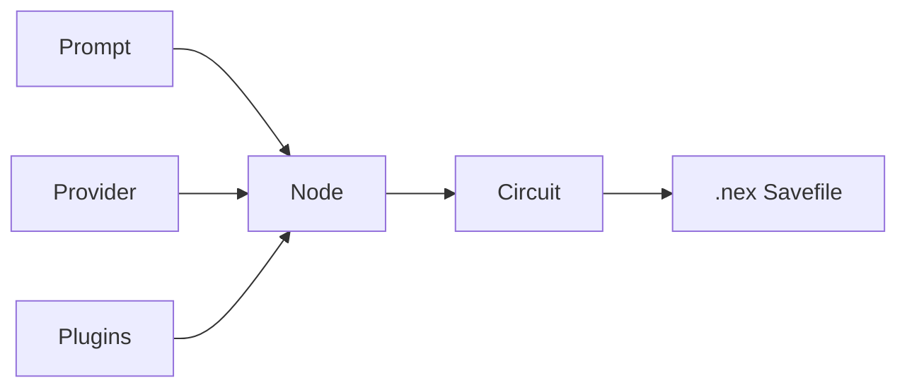

# 🚦 Nexa

> **Find exactly where one AI execution diverged from another.**

**Status:** Early public release

Nexa is a node-based runtime for AI workflows that makes execution **inspectable, comparable, replayable, and easier to debug**.

Instead of treating AI behavior as an opaque prompt chain, Nexa treats execution as a system you can examine.

> **Why did this AI execution end differently from the last one?**

---

## ⚡ Understand Nexa in 30 seconds

Run the official demo:

```bash
nexa run examples/real_ai_bug_autopsy_multinode/investment_demo_A.nex --out run_a.json
nexa run examples/real_ai_bug_autopsy_multinode/investment_demo_B.nex --out run_b.json
nexa diff examples/real_ai_bug_autopsy_multinode/runs/run_a.json examples/real_ai_bug_autopsy_multinode/runs/run_b.json
```

This demo requires:

- a valid provider API key
- network access

What this demo shows:

- a small wording change shifts the upstream AI interpretation
- that change propagates through downstream nodes
- the final investment decision flips
- Nexa shows **where** execution diverged and **how** that divergence spread

**In other words:** a tiny upstream change can cascade into a materially different downstream decision, and Nexa makes that change visible.

### Example demo outcome

| Demo | Result |
|------|--------|
| A | `INVEST` |
| B | `DO_NOT_INVEST` |

---

## 🔍 Why Nexa exists

When an AI workflow behaves differently from one run to the next, most teams are left guessing.

- Which node changed?
- Was the difference caused by model output or downstream logic?
- Was it prompt interpretation, state propagation, or scoring?
- Is the change acceptable, or is it a regression?

Nexa exists to answer those questions.

It does **not** promise fake determinism for LLMs.
Instead, it provides a clearer execution model so AI behavior becomes easier to inspect, compare, replay, and trust.

---

## 🧠 Core concepts

Nexa is built around a simple idea:

**AI execution should be modeled as a system, not as an opaque prompt chain.**



### Node

A **node** is the smallest execution unit in Nexa.

A node can reference:

- a **prompt**
- a **provider**
- a **plugins**

around a shared working context.
Depending on the node’s role, any of these components may be absent.

That matters because Nexa does not treat an AI workflow as “call a model and wait for the result.”
It treats each step as an explicit execution unit that can be inspected, compared, replayed, and debugged.

### Circuit

A **circuit** is a dependency graph of nodes.

Nexa does not force execution through a fixed pipeline. Instead, nodes run when their dependencies are satisfied.
This makes the system better suited to real workflows where small upstream changes can propagate into multiple downstream decisions.

- a **pipeline** assumes a fixed stage order
- a **circuit** models execution as dependency-driven computation

### Savefile

A **`.nex` file** is Nexa’s primary runnable artifact.

It is not just a graph definition. A `.nex` savefile can include:

- the **circuit**
- the current **state**
- required **resources**
- UI-related data needed to reproduce execution

That makes a savefile closer to a reproducible execution package than a simple workflow description.

---

## 🧱 What Nexa provides

At a practical level, Nexa gives you the pieces needed to execute, inspect, compare, and revisit AI workflows.

- **node-based execution** for AI workflows
- **run-to-run diff** for outputs and state changes
- **replay** and **audit-pack export** for investigation and review
- **provider abstraction** across multiple model backends
- a **savefile-first `.nex` model** for runnable AI artifacts

Supported providers:

- OpenAI / GPT
- Codex
- Claude
- Gemini
- Perplexity

Official public demo:

```text
examples/real_ai_bug_autopsy_multinode/
```

---

## 📦 Requirements

- **Python 3.10+**

---

## 🚀 Quick start

### 1. Create and activate a virtual environment

#### Linux / macOS

```bash
python -m venv .venv
source .venv/bin/activate
pip install -e .
```

#### Windows PowerShell

```powershell
python -m venv .venv
.\.venv\Scripts\Activate.ps1
pip install -e .
```

### 2. Configure provider API keys

You can use shell environment variables or a project-root `.env` file.

Example:

```dotenv
OPENAI_API_KEY=your_openai_key
ANTHROPIC_API_KEY=your_anthropic_key
GEMINI_API_KEY=your_gemini_key
PERPLEXITY_API_KEY=your_perplexity_key
```

Perplexity also accepts this alias:

```dotenv
PPLX_API_KEY=your_perplexity_key
```

### 3. Run the official demo and diff the results

```bash
nexa run examples/real_ai_bug_autopsy_multinode/investment_demo_A.nex --out run_a.json
nexa run examples/real_ai_bug_autopsy_multinode/investment_demo_B.nex --out run_b.json
nexa diff examples/real_ai_bug_autopsy_multinode/runs/run_a.json examples/real_ai_bug_autopsy_multinode/runs/run_b.json
```

---

## 🧭 CLI surface

```text
nexa run <file.nex>
nexa compare <run_a.json> <run_b.json>
nexa diff <left.json> <right.json> [--json] [--regression]
nexa export <run.json> --out <audit_pack.zip>
nexa replay <audit_pack.zip> [--strict]
nexa info
nexa task generate <feature>
nexa task prompt <feature> <step_id>
```

---

## 🚫 What Nexa is not

Nexa is not:

- a chatbot framework
- a no-code automation builder
- a model training framework
- a promise of deterministic LLM outputs

Its goal is narrower and more practical:

> **make AI execution inspectable, comparable, and trustworthy enough to engineer seriously**

---

## 🌐 Vision

Nexa aims to become a foundational runtime for **traceable AI computation**.

The goal is not to force LLMs into fake determinism.
The goal is to make AI systems understandable enough to debug, review, replay, and evaluate like real software systems.

Over time, Nexa should evolve from a debugging-oriented runtime into a more general execution foundation for AI systems that need traceability, comparison, and operational trust.

---

## 📚 Read next

If you want the architecture and implementation details, continue here:

1. `docs/INDEX.md`
2. `docs/BLUEPRINT.md`
3. `docs/DEVELOPMENT.md`
4. `docs/PROVIDER_SYSTEM.md`
